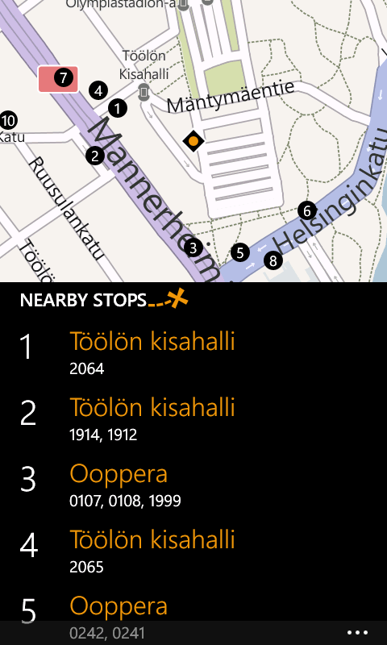

# Reitit

My Reitit app was the most popular app for public transit in the Helsinki metropolitan area for Windows Phone, before the downfall of the platform. Reitit in Finnish means "routes". 

I put significant time into UI/UX design for Reitit, balancing adherance to the (rather spartan) Metro design language with its "typography first" approach while both delighting users and getting all the relevant information out. Here's a walkthrough of some highlights.

First off, the route search results and route details pages use custom-made controls for visualizing routes as timelines. These custom controls were significant improvements over layouts easily achievable with built-in controls.

 

Not shown here, but clicking that map button on the route results screen above would flip the whole page over with a nice animation to reveal a map overview of the routes.

Next, as a ubiquitous design element all pages with location information show a map at the top for context, seen below on the "stop information", "line information" and "nearby stop search" pages. Note how on the stop information page the map section is very small, as it does not need to be interacted with. On the line information page touching the map would expand it for further examination, and as such the map is made larger to present a more comfortable touch target. On the nearby stop search page the map is directly interactable and therefore is further enlargened for easy interaction.

   

Finally, the home page, which uses the side-scrolling Hub control, shows a graphic design element I was rather satisfied with. To give the user a sense of location when switching between categories, the title has a wide rainbow-dotted-line design that echoes the app logo. Having that large design element in the background that would otherwise be a flat color significantly improved the tactile feel of the home page.

 

The logo, for reference:

